# CARE-SM OBO Model — Birthdate

Mermaid transcription of [`CARE-SM-obo-Birthdate.drawio.png`](https://raw.githubusercontent.com/CARE-SM/CARE-Semantic-Model/main/images/obo/CARE-SM-obo-Birthdate.drawio.png).

**Legend**
- `sio:` = http://semanticscience.org/resource/
- `obo:` = http://purl.obolibrary.org/obo/
- Diamond, orange border = Used Instance
- Diamond, grey border = Unused Instance
- Rectangle, green border = Class
- Rectangle, blue border = Data value

```mermaid
flowchart TD
    classDef usedInstance fill:#ffffff,stroke:#d79b00,stroke-width:2px,color:#333
    classDef unusedInstance fill:#f5f5f5,stroke:#666666,stroke-width:2px,color:#333
    classDef classNode fill:#ffffff,stroke:#82b366,stroke-width:2px,color:#333
    classDef dataValue fill:#ffffff,stroke:#6c8ebf,stroke-width:2px,color:#333

    %% Instances
    ID_{{ID_}}:::usedInstance
    Individual_{{Individual_}}:::usedInstance
    Role_{{Role_}}:::usedInstance
    Process_{{Process_}}:::usedInstance
    Output_{{Output_}}:::usedInstance
    Attribute_{{Attribute_}}:::usedInstance
    URIProtocol{{"URI for the protocol"}}:::usedInstance

    SpecificProcess_{{Specific_process_}}:::unusedInstance
    Input_{{Input_}}:::unusedInstance
    Target_{{Target_}}:::unusedInstance
    Frequency_{{Frequency_}}:::unusedInstance
    Causality_{{Causality_}}:::unusedInstance
    Unit_{{Unit_}}:::unusedInstance
    OutputIdentifier_{{Output_identifier_}}:::unusedInstance

    %% Classes
    SIO_000115["sio:SIO_000115<br/>(identifier)"]:::classNode
    SIO_000498["sio:SIO_000498<br/>(person)"]:::classNode
    OBI_0000093["obo:OBI_0000093<br/>(patient role)"]:::classNode
    SIO_000016["sio:SIO_000016<br/>(role)"]:::classNode
    SIO_000006["sio:SIO_000006<br/>(process)"]:::classNode
    NCIT_C142470["obo:NCIT_C142470<br/>(Data Capture)"]:::classNode
    OBI_0000272["obo:OBI_0000272<br/>(protocol)"]:::classNode
    SIO_000090["sio:SIO_000090<br/>(specification)"]:::classNode
    SIO_000015["sio:SIO_000015<br/>(information content entity)"]:::classNode
    NCIT_C70856["obo:NCIT_C70856<br/>(Observation Result)"]:::classNode
    NCIT_C68615["obo:NCIT_C68615<br/>(Birth Date)"]:::classNode
    SIO_000614["sio:SIO_000614<br/>(attribute)"]:::classNode

    %% Data values
    IndividualID["individual ID"]:::dataValue
    Comments["comments"]:::dataValue
    ISO8601["ISO 8601 formatted date"]:::dataValue

    %% Edges
    ID_ -->|"sio:SIO_000300 (has value)"| IndividualID
    ID_ -->|"rdf:type"| SIO_000115
    ID_ -->|"sio:SIO_000020 (denotes)"| Role_

    Individual_ -->|"rdf:type"| SIO_000498
    Individual_ -->|"sio:SIO_000228 (has role)"| Role_

    Role_ -->|"rdf:type"| OBI_0000093
    Role_ -->|"rdf:type"| SIO_000016
    Role_ -->|"sio:SIO_000356 (is realized in)"| Process_

    Process_ -->|"sio:SIO_000028 (has part)"| SpecificProcess_
    Process_ -->|"sio:SIO_000230 (has input)"| Input_
    Process_ -->|"sio:SIO_000291 (has target)"| Target_
    Process_ -->|"sio:SIO_000900 (has frequency)"| Frequency_
    Process_ -->|"rdf:type"| SIO_000006
    Process_ -->|"rdf:type"| NCIT_C142470
    Process_ -->|"rdfs:comment"| Comments
    Process_ -->|"sio:SIO_000339 (is specified by)"| URIProtocol
    Process_ -->|"sio:SIO_000229 (has output)"| Output_

    URIProtocol -->|"rdf:type"| OBI_0000272
    URIProtocol -->|"rdf:type"| SIO_000090

    Output_ -->|"sio:SIO_00243 (is causally related with)"| Causality_
    Output_ -->|"sio:SIO_000300 (has value)"| ISO8601
    Output_ -->|"rdf:type"| SIO_000015
    Output_ -->|"rdf:type"| NCIT_C70856
    Output_ -->|"sio:SIO_000221 (has unit)"| Unit_
    Output_ -->|"sio:SIO_000671 (has identifier)"| OutputIdentifier_
    Output_ -->|"sio:SIO_000628 (refers to)"| Attribute_

    Attribute_ -->|"rdf:type"| NCIT_C68615
    Attribute_ -->|"rdf:type"| SIO_000614
```

