# CARE-SM OBO Model — Disability

Mermaid transcription of [`CARE-SM-obo-Disability.drawio.png`](https://raw.githubusercontent.com/CARE-SM/CARE-Semantic-Model/main/images/obo/CARE-SM-obo-Disability.drawio.png).

**Legend**
- `sio:` = http://semanticscience.org/resource/
- `obo:` = http://purl.obolibrary.org/obo/
- Diamond, orange border = Used Instance
- Rectangle, green border = Class
- Rectangle, blue border = Data value

Note: "Unused Instance" nodes (grey diamonds) from the source diagram are omitted as uninformative.

```mermaid
flowchart TD
    classDef usedInstance fill:#ffffff,stroke:#d79b00,stroke-width:7px,color:#333
    classDef classNode fill:#ffffff,stroke:#82b366,stroke-width:7px,color:#333
    classDef dataValue fill:#ffffff,stroke:#6c8ebf,stroke-width:7px,color:#333
    linkStyle default stroke:#555,stroke-width:5px

    %% Instances
    ID_{{ID_}}:::usedInstance
    Individual_{{Individual_}}:::usedInstance
    Role_{{Role_}}:::usedInstance
    Process_{{Process_}}:::usedInstance
    IRISpecificAssessment{{"IRI for the specific assessment"}}:::usedInstance
    Output_{{Output_}}:::usedInstance
    Attribute_{{Attribute_}}:::usedInstance
    Unit_{{Unit_}}:::usedInstance
    Startdate_{{Startdate_}}:::usedInstance
    Enddate_{{Enddate_}}:::usedInstance

    %% Classes
    SIO_000115["sio:SIO_000115<br/>(identifier)"]:::classNode
    SIO_000498["sio:SIO_000498<br/>(person)"]:::classNode
    OBI_0000093["obo:OBI_0000093<br/>(patient role)"]:::classNode
    SIO_000016["sio:SIO_000016<br/>(role)"]:::classNode
    SIO_000006["sio:SIO_000006<br/>(process)"]:::classNode
    OMIT_0005448["obo:OMIT_0005448<br/>(Disability Evaluation)"]:::classNode
    OBI_0000272["obo:OBI_0000272<br/>(protocol)"]:::classNode
    SIO_000090["sio:SIO_000090<br/>(specification)"]:::classNode
    SIO_000015["sio:SIO_000015<br/>(information content entity)"]:::classNode
    NCIT_C49149["obo:NCIT_C49149<br/>(Answer)"]:::classNode
    SIO_000074["sio:SIO_000074<br/>(unit of measurement)"]:::classNode
    IRIUnitMeasurement["IRI for<br/>unit of measurement"]:::classNode
    SIO_000614["sio:SIO_000614<br/>(attribute)"]:::classNode
    NCIT_C217011["obo:NCIT_C217011<br/>(Duration Quantity Value)"]:::classNode
    SIO_000031["sio:SIO_000031<br/>(start date)"]:::classNode
    SIO_000032["sio:SIO_000032<br/>(end date)"]:::classNode

    %% Data values
    IndividualID["individual ID"]:::dataValue
    Comments["comments"]:::dataValue
    ScaleScoreValue["Scale/Score/Value"]:::dataValue
    DurationXSD["Duration time as xsd:duration"]:::dataValue
    ISO8601Start["ISO 8601 formatted date"]:::dataValue
    ISO8601End["ISO 8601 formatted date"]:::dataValue

    %% Real edges (indices 0-30)
    ID_ -->|"sio:SIO_000300 (has value)"| IndividualID
    ID_ -->|"rdf:type"| SIO_000115
    ID_ -->|"sio:SIO_000020 (denotes)"| Role_

    Individual_ -->|"rdf:type"| SIO_000498
    Individual_ -->|"sio:SIO_000228 (has role)"| Role_

    Role_ -->|"rdf:type"| OBI_0000093
    Role_ -->|"rdf:type"| SIO_000016
    Role_ -->|"sio:SIO_000356 (is realized in)"| Process_

    Process_ -->|"rdf:type"| SIO_000006
    Process_ -->|"rdf:type"| OMIT_0005448
    Process_ -->|"rdfs:comment"| Comments
    Process_ -->|"sio:SIO_000339 (is specified by)"| IRISpecificAssessment
    Process_ -->|"sio:SIO_000229 (has output)"| Output_

    IRISpecificAssessment -->|"rdf:type"| OBI_0000272
    IRISpecificAssessment -->|"rdf:type"| SIO_000090

    Output_ -->|"sio:SIO_000628 (refers to)"| Attribute_
    Output_ -->|"sio:SIO_000221 (has unit)"| Unit_
    Output_ -->|"rdf:type"| SIO_000015
    Output_ -->|"rdf:type"| NCIT_C49149
    Output_ -->|"sio:SIO_000300 (has value)"| ScaleScoreValue

    Unit_ -->|"rdf:type"| SIO_000074
    Unit_ -->|"rdf:type"| IRIUnitMeasurement

    Attribute_ -->|"rdf:type"| SIO_000614
    Attribute_ -->|"rdf:type"| NCIT_C217011
    Attribute_ -->|"sio:SIO_000680 (has start time)"| Startdate_
    Attribute_ -->|"sio:SIO_000681 (has end time)"| Enddate_
    Attribute_ -->|"sio:SIO_000300 (has value)"| DurationXSD

    Startdate_ -->|"rdf:type"| SIO_000031
    Startdate_ -->|"sio:SIO_000300 (has value)"| ISO8601Start

    Enddate_ -->|"rdf:type"| SIO_000032
    Enddate_ -->|"sio:SIO_000300 (has value)"| ISO8601End

    %% Invisible layout-only chains (indices 31-42, hidden below) force siblings into one column
    IndividualID ~~~ SIO_000115
    OBI_0000093 ~~~ SIO_000016
    SIO_000006 ~~~ OMIT_0005448 ~~~ Comments
    OBI_0000272 ~~~ SIO_000090
    SIO_000015 ~~~ NCIT_C49149 ~~~ ScaleScoreValue
    SIO_000074 ~~~ IRIUnitMeasurement
    SIO_000614 ~~~ NCIT_C217011 ~~~ DurationXSD
    SIO_000031 ~~~ ISO8601Start
    SIO_000032 ~~~ ISO8601End

    linkStyle 31,32,33,34,35,36,37,38,39,40,41,42 stroke:none
```

