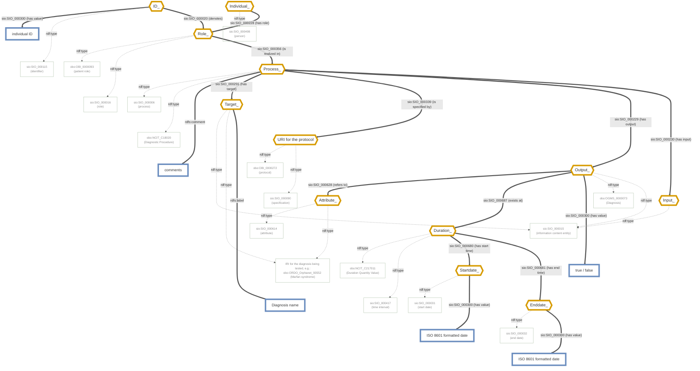

# CARE-SM OBO Model — Diagnosis

Mermaid transcription of [`CARE-SM-obo-Diagnosis.drawio.png`](https://raw.githubusercontent.com/CARE-SM/CARE-Semantic-Model/main/images/obo/CARE-SM-obo-Diagnosis.drawio.png).

**Legend**
- `sio:` = http://semanticscience.org/resource/
- `obo:` = http://purl.obolibrary.org/obo/
- Diamond, orange border = Used Instance
- Rectangle, green border = Class
- Rectangle, blue border = Data value

**Note on `Process_ --has input--> Input_`:** this edge is a deliberate schema placeholder, not an actively populated relationship. A diagnosis is generally *informed by* prior evidence (lab results, genotyping, phenotype observations, etc.), and `has-input` is the structurally correct place to express that provenance if it's ever needed. However, "which evidence supports this diagnosis" is an interpretive judgment that can legitimately differ between users of the same data — it is not a fixed fact that should be asserted once and stored. Baking a specific evidentiary link into the graph would freeze one interpretation as ground truth. Instead, evidence-gathering is expected to happen at query time, as an ad hoc join across the independently-existing `Output_` nodes of whatever processes occurred for the same patient/encounter — nothing needs to be pre-linked for that to work. Consequently, `Input_` is emitted as an empty bnode typed only `rdf:type sio:SIO_000015` (information content entity) — present in the schema, intentionally inert. A future use case that genuinely needs to persist a specific evidentiary link could extend `Input_` with real content (e.g. a stringified reference, following the same bnode-plus-literal-value pattern used for `Identifier_` elsewhere in this model) without breaking anything that depends on the current empty form.

 
 

<!-- mermaid-start -->

<!-- mermaid-end -->
