# CARE-SM OBO Model — Functional Assessment

Renamed from the original CARE-SM "Disability" model — this covers any named, structured functional-assessment instrument, from a single objective performance test (e.g. the 10-Metre Walk Test) to a multi-item battery or self-reported questionnaire (e.g. WHODAS 2.0). Originally transcribed from [`CARE-SM-obo-Disability.drawio.png`](https://raw.githubusercontent.com/CARE-SM/CARE-Semantic-Model/main/images/obo/CARE-SM-obo-Disability.drawio.png); substantially restructured since (metric/protocol split, optional output label — see notes below).

**Legend**
- `sio:` = http://semanticscience.org/resource/
- `obo:` = http://purl.obolibrary.org/obo/
- Diamond, orange border = Used Instance
- Rectangle, green border = Class
- Rectangle, blue border = Data value

**Note on `Target_` vs `URIProtocol`:** the specific instrument/metric being assessed (e.g. "this is a WHODAS 2.0 assessment") is recorded via `has target`, separate from the exact protocol/procedure by which it was administered (`is specified by`). These are independent: the same instrument can be delivered under different protocols (e.g. with or without a warm-up period), so conflating them into one node — as the original model did — loses that distinction. `URIProtocol` is optional but recommended.

**Note on `Output_`'s label:** `Output_` carries an optional human-readable label (e.g. "output from WHODAS 2.0"). The CSV author only needs to supply the metric's IRI via `Target_`; resolving that IRI to a label is expected to happen in the CARE-SM Toolkit (e.g. via an ontology lookup), not by requiring the CSV author to separately type out a matching label by hand.

**Known open item:** `Output_`'s `rdf:type obo:NCIT_C49149` ("Answer") was inherited from the original Questionnaire-flavored framing of this model and doesn't cleanly fit a general functional-assessment result (a score isn't really an "answer"). Left in place for now since a corrected replacement class wasn't confirmed — flagging for follow-up rather than guessing at an unverified ontology term.

```mermaid
%%{init: {"themeVariables": {"lineColor": "#888888"}}}%%
flowchart TD
    classDef usedInstance fill:#ffffff,stroke:#d79b00,stroke-width:7px,color:#333,font-size:20px
    classDef classNode fill:transparent,stroke:#b9c9b4,stroke-width:1.5px,color:#888,font-size:14px
    classDef dataValue fill:#ffffff,stroke:#6c8ebf,stroke-width:7px,color:#333,font-size:18px
    linkStyle default stroke:#888888,stroke-width:3px

    %% Instances
    ID_{{ID_}}:::usedInstance
    Individual_{{Individual_}}:::usedInstance
    Role_{{Role_}}:::usedInstance
    Process_{{Process_}}:::usedInstance
    URIProtocol{{"URI for the protocol"}}:::usedInstance
    Target_{{Target_}}:::usedInstance
    Output_{{Output_}}:::usedInstance
    Duration_{{Duration_}}:::usedInstance
    Unit_{{Unit_}}:::usedInstance
    Startdate_{{Startdate_}}:::usedInstance
    Enddate_{{Enddate_}}:::usedInstance

    %% Classes
    SIO_000115["sio:SIO_000115<br/>(identifier)"]:::classNode
    SIO_000498["sio:SIO_000498<br/>(person)"]:::classNode
    OBI_0000093["obo:OBI_0000093<br/>(patient role)"]:::classNode
    SIO_000016["sio:SIO_000016<br/>(role)"]:::classNode
    SIO_000006["sio:SIO_000006<br/>(process)"]:::classNode
    OMIT_0005448["obo:OMIT_0005448<br/>(Disability Evaluation)"]:::classNode
    OBI_0000272["obo:OBI_0000272<br/>(protocol)"]:::classNode
    SIO_000090["sio:SIO_000090<br/>(specification)"]:::classNode
    FunctionalMetric["IRI for the specific functional assessment<br/>instrument/metric used, e.g.:<br/>WHODAS 2.0, 10-Metre Walk Test"]:::classNode
    SIO_000015["sio:SIO_000015<br/>(information content entity)"]:::classNode
    NCIT_C49149["obo:NCIT_C49149<br/>(Answer)"]:::classNode
    SIO_000074["sio:SIO_000074<br/>(unit of measurement)"]:::classNode
    IRIUnitMeasurement["IRI for<br/>unit of measurement"]:::classNode
    NCIT_C217011["obo:NCIT_C217011<br/>(Duration Quantity Value)"]:::classNode
    SIO_000417["sio:SIO_000417<br/>(time interval)"]:::classNode
    SIO_000031["sio:SIO_000031<br/>(start date)"]:::classNode
    SIO_000032["sio:SIO_000032<br/>(end date)"]:::classNode

    %% Data values
    IndividualID["individual ID"]:::dataValue
    Comments["comments"]:::dataValue
    ScaleScoreValue["Scale/Score/Value"]:::dataValue
    OutputLabel["Human-readable label describing the output,<br/>e.g. 'output from WHODAS 2.0'"]:::dataValue
    ISO8601Start["ISO 8601 formatted date"]:::dataValue
    ISO8601End["ISO 8601 formatted date"]:::dataValue

    %% Real edges (indices 0-33)
    ID_ -->|"sio:SIO_000300 (has value)"| IndividualID
    ID_ -->|"rdf:type"| SIO_000115
    ID_ -->|"sio:SIO_000020 (denotes)"| Role_

    Individual_ -->|"rdf:type"| SIO_000498
    Individual_ -->|"sio:SIO_000228 (has role)"| Role_

    Role_ -->|"rdf:type"| OBI_0000093
    Role_ -->|"rdf:type"| SIO_000016
    Role_ -->|"sio:SIO_000356 (is realized in)"| Process_

    Process_ -->|"rdf:type"| SIO_000006
    Process_ -->|"rdf:type"| OMIT_0005448
    Process_ -->|"rdfs:comment"| Comments
    Process_ -->|"sio:SIO_000291 (has target)"| Target_
    Process_ -->|"sio:SIO_000339 (is specified by)"| URIProtocol
    Process_ -->|"sio:SIO_000229 (has output)"| Output_

    Target_ -->|"rdf:type"| SIO_000015
    Target_ -->|"rdf:type"| FunctionalMetric

    URIProtocol -->|"rdf:type"| OBI_0000272
    URIProtocol -->|"rdf:type"| SIO_000090

    Output_ -->|"sio:SIO_000687 (exists at)"| Duration_
    Output_ -->|"sio:SIO_000221 (has unit)"| Unit_
    Output_ -->|"rdf:type"| SIO_000015
    Output_ -->|"rdf:type"| NCIT_C49149
    Output_ -->|"sio:SIO_000300 (has value)"| ScaleScoreValue
    Output_ -->|"rdfs:label"| OutputLabel

    Unit_ -->|"rdf:type"| SIO_000074
    Unit_ -->|"rdf:type"| IRIUnitMeasurement

    Duration_ -->|"rdf:type"| NCIT_C217011
    Duration_ -->|"rdf:type"| SIO_000417
    Duration_ -->|"sio:SIO_000680 (has start time)"| Startdate_
    Duration_ -->|"sio:SIO_000681 (has end time)"| Enddate_

    Startdate_ -->|"rdf:type"| SIO_000031
    Startdate_ -->|"sio:SIO_000300 (has value)"| ISO8601Start

    Enddate_ -->|"rdf:type"| SIO_000032
    Enddate_ -->|"sio:SIO_000300 (has value)"| ISO8601End

    %% Invisible layout-only chains (indices 34-50, hidden below) force siblings into one column
    IndividualID ~~~ SIO_000115
    OBI_0000093 ~~~ SIO_000016
    SIO_000006 ~~~ OMIT_0005448 ~~~ Comments
    SIO_000015 ~~~ FunctionalMetric
    OBI_0000272 ~~~ SIO_000090
    SIO_000015 ~~~ NCIT_C49149 ~~~ ScaleScoreValue ~~~ OutputLabel
    SIO_000074 ~~~ IRIUnitMeasurement
    NCIT_C217011 ~~~ SIO_000417
    SIO_000031 ~~~ ISO8601Start
    SIO_000032 ~~~ ISO8601End
    Target_ ~~~ URIProtocol ~~~ Output_
    Duration_ ~~~ Unit_
    Startdate_ ~~~ Enddate_

    %% rdf:type edges (indices 1,3,5,6,8,9,14,15,16,17,20,21,24,25,26,27,30,32) de-emphasized so the structural backbone stands out
    linkStyle 1,3,5,6,8,9,14,15,16,17,20,21,24,25,26,27,30,32 stroke:#bbb,stroke-width:2px,stroke-dasharray:4 3
    linkStyle 34,35,36,37,38,39,40,41,42,43,44,45,46,47,48,49,50 stroke:none
```

 
 

<!-- mermaid-start -->

<!-- mermaid-end -->
