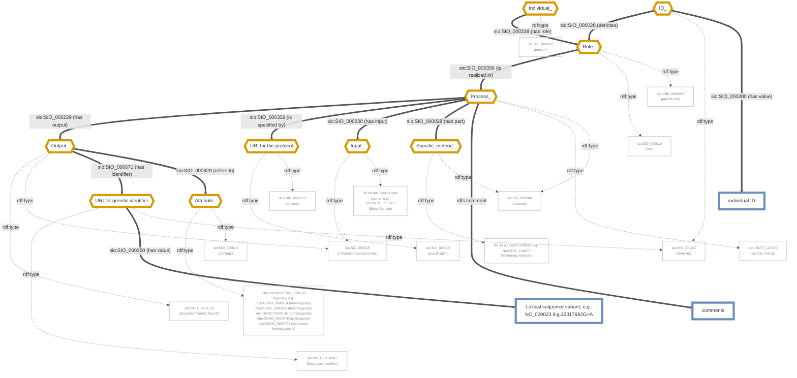

# CARE-SM OBO Model — Genetic

Mermaid transcription of [`CARE-SM-obo-Genetic.drawio.png`](https://raw.githubusercontent.com/CARE-SM/CARE-Semantic-Model/main/images/obo/CARE-SM-obo-Genetic.drawio.png).

**Legend**
- `sio:` = http://semanticscience.org/resource/
- `obo:` = http://purl.obolibrary.org/obo/
- Diamond, orange border = Used Instance
- Rectangle, green border = Class
- Rectangle, blue border = Data value

 
 

<!-- mermaid-start -->

<!-- mermaid-end -->
